# CleanGo — Guide utilisateur et support de formation

**Version du document :** 1.0  
**Date :** 25 juillet 2026  
**Public concerné :** responsables de station, caissiers, agents d’accueil, superviseurs et administrateurs.

---

## 1. Présentation de CleanGo

CleanGo est une application de gestion destinée aux entreprises de lavage automobile. Elle centralise le suivi des clients, des véhicules, des prestations, des laveurs, des paiements, des factures et de la caisse.

L’application transforme chaque lavage en une opération traçable, depuis l’arrivée du véhicule jusqu’à l’encaissement et à l’analyse des performances.

## 2. À quels besoins l’application répond-elle ?

### 2.1 Problèmes rencontrés sans outil centralisé

Une station gérée avec des cahiers ou des fichiers séparés rencontre souvent les difficultés suivantes :

- perte ou duplication d’informations sur les clients et les véhicules ;
- difficulté à connaître le nombre exact de lavages réalisés ;
- manque de visibilité sur les véhicules en attente ou en cours ;
- erreurs dans le suivi des montants payés et restant à payer ;
- calcul manuel des commissions des laveurs ;
- factures et justificatifs difficiles à retrouver ;
- caisse difficile à contrôler ;
- absence d’indicateurs fiables pour piloter l’activité.

### 2.2 Réponse apportée par CleanGo

| Besoin métier | Réponse de CleanGo |
|---|---|
| Suivre l’activité en temps réel | Tableau de bord avec passages, chiffre d’affaires, taux de réalisation et commissions |
| Organiser les lavages | Création d’un passage et suivi des statuts « En attente », « En cours », « Terminé » ou « Annulé » |
| Fidéliser les clients | Fichier clients centralisé et historique exploitable |
| Identifier les véhicules | Fiches véhicules associées aux clients et aux immatriculations |
| Encadrer le personnel | Gestion des employés et affectation d’un laveur à chaque prestation |
| Maîtriser les recettes | Suivi du total, du montant payé, du reste à payer et du mode de règlement |
| Calculer les commissions | Calcul et restitution des commissions liées aux passages |
| Justifier les opérations | Génération et consultation des factures |
| Contrôler la trésorerie | Registre des mouvements de caisse et des encaissements |
| Adapter l’offre commerciale | Paramétrage des types de lavage, des véhicules concernés et des tarifs |
| Prendre des décisions | Reporting filtrable par période, statut, client, véhicule ou prestation |
| Administrer la structure | Configuration de l’entreprise, des comptes, rôles, civilités, e-mails et abonnement |

## 3. Profils utilisateurs

- **Administrateur / responsable :** paramètre l’entreprise, crée les comptes et les rôles, consulte tous les indicateurs et contrôle la caisse.
- **Agent d’accueil :** enregistre les clients, véhicules et passages.
- **Superviseur :** affecte les travaux, met à jour leur statut et suit l’avancement.
- **Caissier :** encaisse les paiements, contrôle les restes à payer et consulte les factures.
- **Gestionnaire :** analyse le chiffre d’affaires, les commissions et les rapports.

Les droits effectivement disponibles dépendent du rôle attribué au compte.

## 4. Connexion

Accéder à la page de connexion, saisir l’adresse e-mail et le mot de passe, puis cliquer sur **Se connecter**.

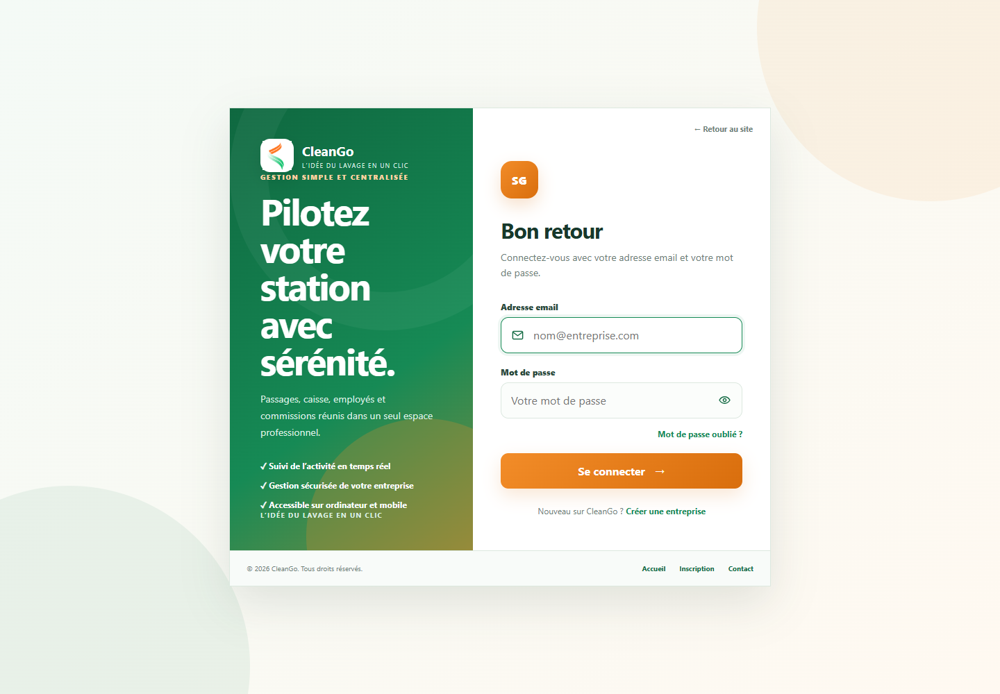

Bonnes pratiques :

- utiliser un compte nominatif ;
- ne jamais partager son mot de passe ;
- se déconnecter après utilisation sur un poste partagé ;
- utiliser la fonction de réinitialisation en cas d’oubli.

## 5. Découverte de l’interface

L’interface comprend :

- un **menu latéral** pour accéder aux modules ;
- un **en-tête** indiquant l’entreprise connectée, l’abonnement et l’utilisateur ;
- une **zone centrale** contenant les indicateurs, formulaires et tableaux ;
- des boutons d’action pour créer, modifier, filtrer, encaisser ou éditer.

## 6. Tableau de bord

Le tableau de bord donne une vue immédiate de l’activité du mois :

- nombre de lavages ;
- taux de réalisation ;
- paiements générés ;
- commissions ;
- dossiers à régler ;
- derniers lavages ;
- activité quotidienne ;
- prestations les plus demandées ;
- effectifs, clients et véhicules suivis.

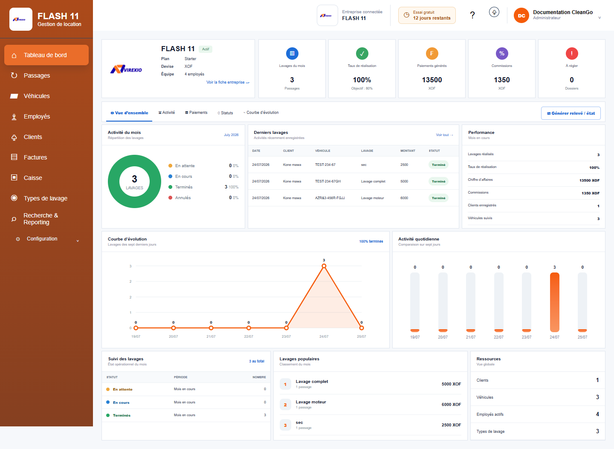

**Utilisation recommandée :** consulter cet écran au début de journée, à mi-journée et avant la clôture afin d’identifier les travaux non terminés ou non réglés.

## 7. Gestion des passages

Un passage représente une opération de lavage. La liste permet de suivre le client, le véhicule, la prestation, le laveur, les montants, le règlement et le statut.

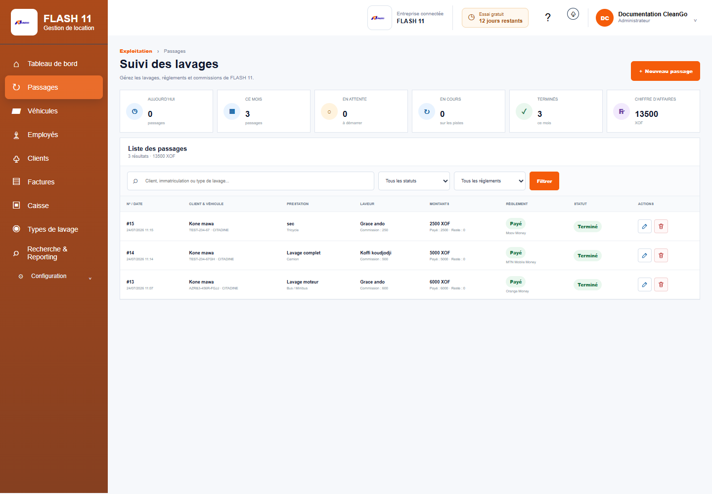

### Créer un passage

1. Ouvrir **Passages**.
2. Cliquer sur **Nouveau passage**.
3. Sélectionner le client et le véhicule.
4. Choisir le type de lavage.
5. Affecter l’employé qui réalise la prestation.
6. Vérifier le montant et la commission.
7. Indiquer le paiement reçu et le mode de règlement.
8. Enregistrer.

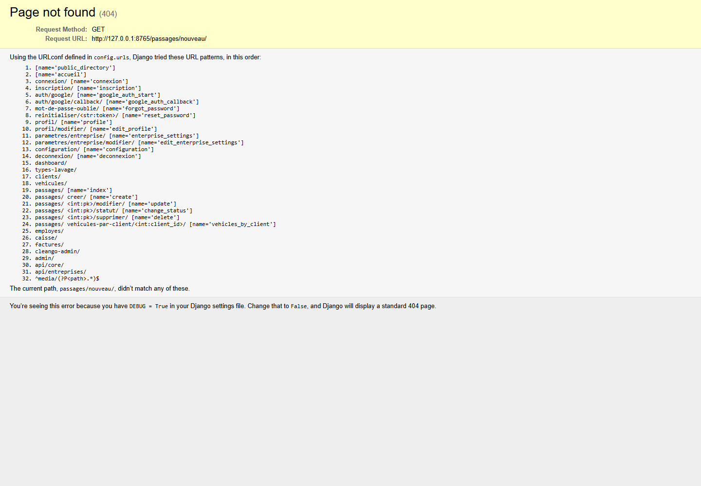

### Faire évoluer un passage

Le cycle normal est :

`En attente → En cours → Terminé`

Un passage peut aussi être annulé. Avant de terminer une prestation, vérifier que le lavage a réellement été effectué et que les informations de paiement sont correctes.

### Règle de qualité

Une opération doit idéalement contenir un client, un véhicule correctement immatriculé, une prestation, un laveur, un montant total, un montant payé et un mode de règlement.

## 8. Gestion des clients

Le module **Clients** constitue le répertoire commercial de la station. Il facilite la recherche, la réutilisation des coordonnées et le rattachement des véhicules.

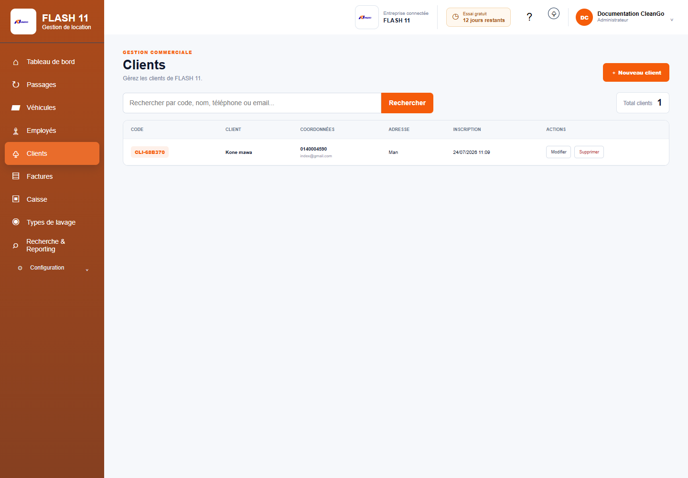

Lors de la création :

- saisir le nom complet ;
- renseigner un téléphone fiable ;
- compléter les autres coordonnées disponibles ;
- vérifier qu’un client similaire n’existe pas déjà.

## 9. Gestion des véhicules

Le module **Véhicules** conserve les véhicules pris en charge et leur propriétaire.

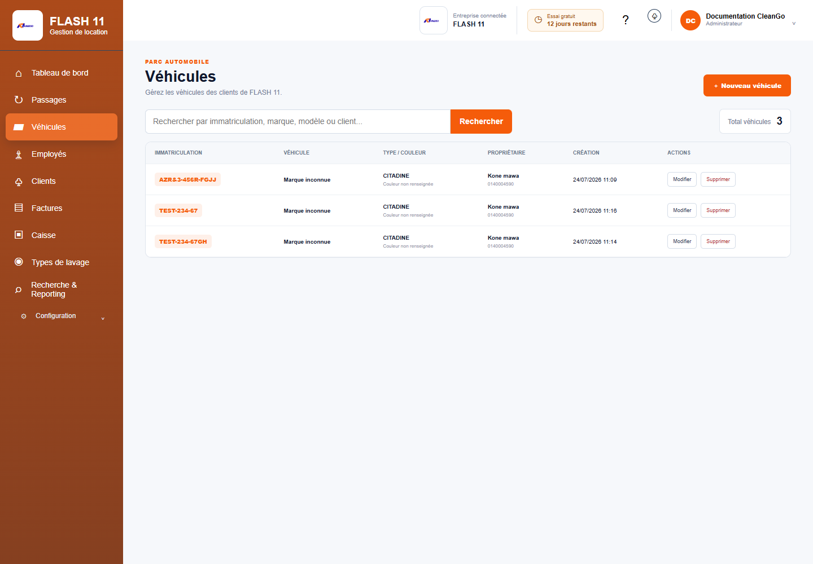

Informations importantes :

- immatriculation ;
- type de véhicule ;
- marque ou modèle si disponible ;
- client propriétaire.

L’immatriculation est l’information principale à contrôler pour éviter les doublons.

## 10. Gestion des employés

Le module **Employés** permet d’enregistrer les collaborateurs et de connaître les laveurs actifs.

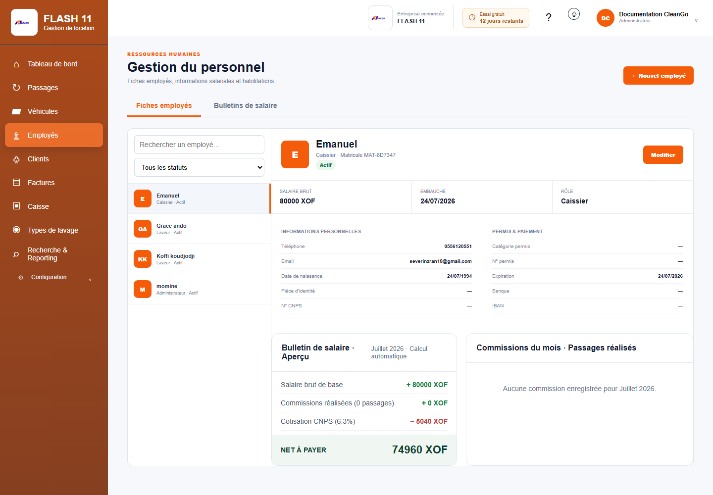

L’affectation d’un employé à chaque passage permet :

- de savoir qui a réalisé la prestation ;
- de calculer sa commission ;
- d’établir un état individuel ;
- d’analyser la charge de travail.

## 11. Factures

Le module **Factures** centralise les documents générés à partir des prestations.

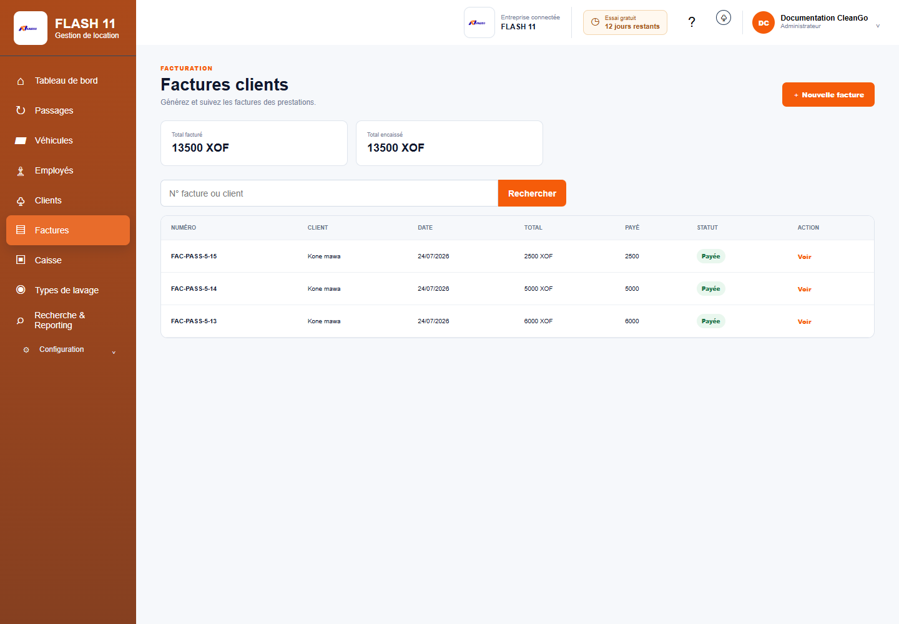

Avant de remettre une facture au client, contrôler :

- l’identité du client ;
- le véhicule ;
- la prestation ;
- le montant ;
- la date et le statut du paiement.

## 12. Caisse et encaissements

Le module **Caisse** présente les opérations financières et leur statut.

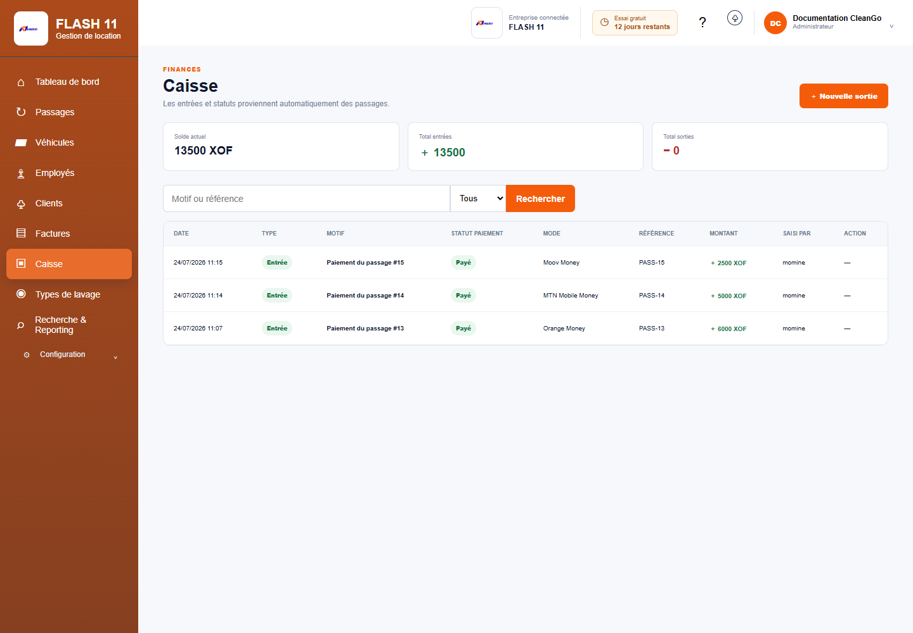

### Procédure d’encaissement

1. Retrouver l’opération concernée.
2. Vérifier le montant total et le montant déjà payé.
3. Saisir le montant reçu.
4. Choisir le mode de paiement.
5. Valider l’encaissement.
6. Vérifier que le reste à payer et le statut ont été actualisés.

### Contrôle de fin de journée

- comparer les paiements saisis aux espèces et relevés électroniques ;
- identifier les paiements partiels ou non payés ;
- vérifier les annulations ;
- expliquer toute différence avant la clôture.

## 13. Types de lavage et tarifs

Le module **Types de lavage** contient le catalogue des prestations proposées.

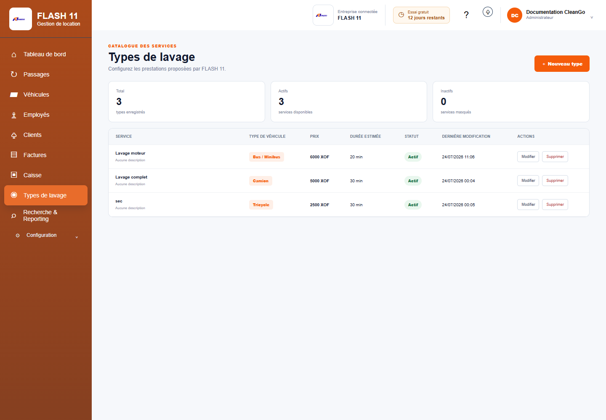

Pour chaque offre, définir :

- un libellé compréhensible ;
- le type de véhicule concerné ;
- le tarif ;
- le statut actif ou inactif.

Avant de modifier un tarif, informer les personnes qui enregistrent les passages et vérifier l’impact sur l’offre commerciale.

## 14. Recherche et reporting

Le reporting permet d’analyser une période et de filtrer les passages par recherche ou statut.

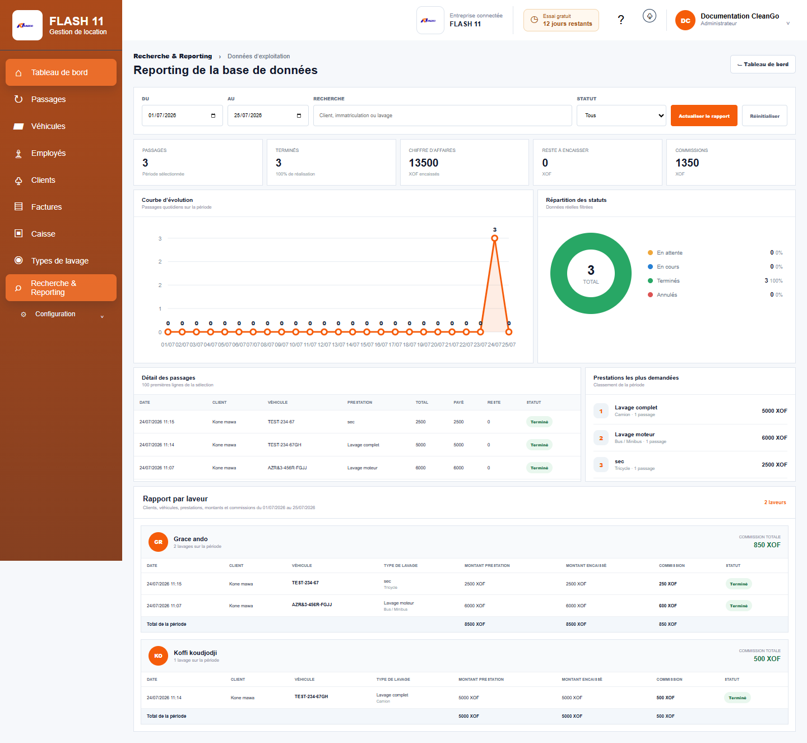

Les indicateurs comprennent notamment :

- nombre total et nombre terminé ;
- taux de réalisation ;
- chiffre d’affaires encaissé ;
- montant restant à percevoir ;
- commissions ;
- répartition par statut ;
- évolution journalière ;
- prestations populaires ;
- états par laveur.

### Exemple de contrôle mensuel

1. Choisir le premier et le dernier jour du mois.
2. Vérifier le nombre de passages annulés.
3. Comparer chiffre d’affaires, reste à payer et caisse.
4. Examiner les commissions par laveur.
5. Identifier les prestations les plus demandées.
6. Utiliser les résultats pour ajuster l’offre et les ressources.

## 15. Configuration

La rubrique **Configuration** regroupe :

- création de comptes ;
- informations de l’entreprise ;
- rôles et droits ;
- civilités ;
- paramètres de messagerie ;
- abonnement.

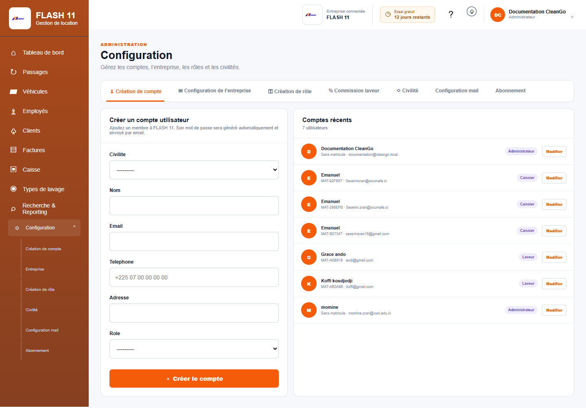

Ces paramètres doivent être réservés aux personnes autorisées. Une modification de rôle, de taux de commission, de tarif ou de configuration de messagerie peut avoir un impact sur plusieurs utilisateurs.

## 16. Parcours opérationnel complet

Le scénario standard d’une station est le suivant :

1. rechercher le client ou créer sa fiche ;
2. rechercher le véhicule ou l’enregistrer ;
3. créer le passage ;
4. choisir la prestation et affecter le laveur ;
5. placer le passage en cours au démarrage ;
6. enregistrer le paiement reçu ;
7. terminer le passage après contrôle ;
8. remettre la facture ou le justificatif ;
9. contrôler la caisse ;
10. analyser l’activité dans le tableau de bord et le reporting.

## 17. Programme de formation recommandé

### Objectif général

À la fin de la formation, les participants doivent être capables d’enregistrer et de suivre un lavage, encaisser le client, éditer son justificatif et contrôler l’activité.

### Format proposé — 3 h 30

| Séquence | Durée | Contenu | Exercice |
|---|---:|---|---|
| 1. Présentation | 20 min | Besoins couverts, rôles et règles de gestion | Identifier le rôle de chaque participant |
| 2. Navigation | 20 min | Connexion, menu, tableau de bord | Retrouver trois indicateurs |
| 3. Référentiels | 40 min | Clients, véhicules, employés, types de lavage | Créer un client et son véhicule |
| 4. Passage | 50 min | Création, affectation, statuts et montants | Enregistrer un lavage complet |
| 5. Paiement | 35 min | Encaissement, reste à payer, facture et caisse | Traiter un paiement partiel puis le solder |
| 6. Reporting | 25 min | Filtres, chiffres d’affaires et commissions | Produire le contrôle d’une période |
| 7. Administration | 20 min | Comptes, rôles et entreprise | Expliquer qui peut modifier les paramètres |
| 8. Évaluation | 20 min | Cas pratique autonome | Réaliser le parcours complet |

### Cas pratique d’évaluation

Le participant doit :

1. créer un client ;
2. enregistrer son véhicule ;
3. ouvrir un passage avec une prestation ;
4. affecter un laveur ;
5. faire passer le travail de l’attente à la fin ;
6. enregistrer un règlement ;
7. retrouver la facture ;
8. confirmer l’opération dans la caisse et le reporting.

**Critère de réussite :** parcours terminé sans doublon, avec des données exactes et un paiement cohérent.

## 18. Bonnes pratiques

- rechercher avant de créer un client ou un véhicule ;
- contrôler l’immatriculation avec le client ;
- mettre les statuts à jour au moment réel de l’opération ;
- ne jamais saisir un paiement non reçu ;
- documenter rapidement toute annulation ;
- vérifier les restes à payer chaque jour ;
- désactiver les comptes des collaborateurs qui quittent l’entreprise ;
- limiter la configuration aux administrateurs ;
- effectuer régulièrement les sauvegardes prévues par l’exploitant.

## 19. Assistance : informations à transmettre

En cas de problème, communiquer :

- le nom de l’entreprise ;
- le compte concerné, sans transmettre son mot de passe ;
- la page utilisée ;
- l’action effectuée ;
- la date et l’heure ;
- le numéro du passage, de la facture ou du client ;
- une capture du message d’erreur.

Ne jamais envoyer de mot de passe, de secret de messagerie ou d’information bancaire dans une demande d’assistance.

## 20. Glossaire

- **Passage :** opération de lavage enregistrée dans CleanGo.
- **Prestation / type de lavage :** service vendu au client.
- **Laveur :** employé affecté à la réalisation du lavage.
- **Montant payé :** somme effectivement reçue.
- **Reste à payer :** différence entre le total et les sommes encaissées.
- **Commission :** part calculée au bénéfice du laveur selon les règles de l’entreprise.
- **Reporting :** synthèse chiffrée et filtrable de l’activité.
- **Référentiel :** ensemble de données réutilisables, par exemple clients, véhicules ou tarifs.

---

**Fin du guide**
